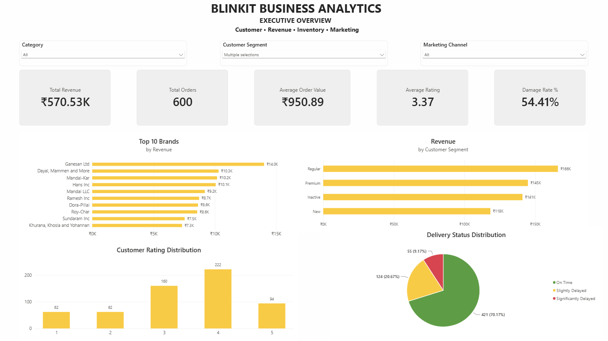
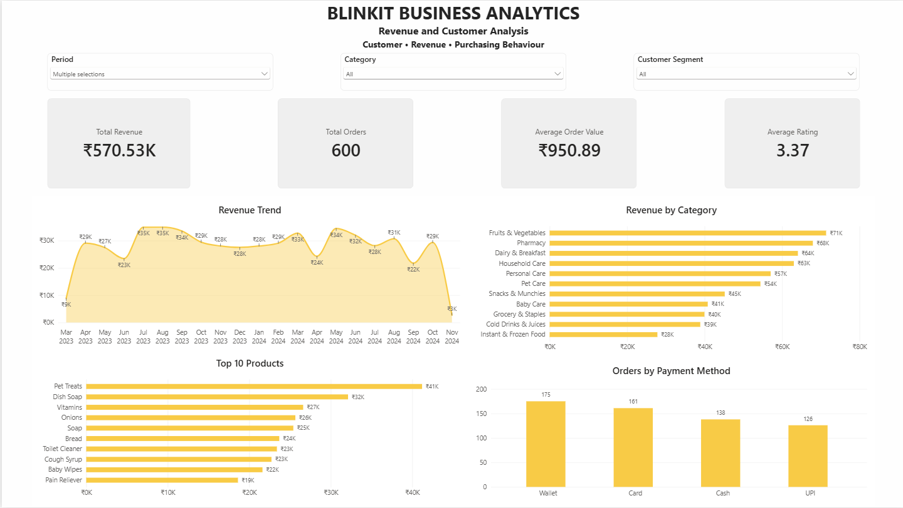
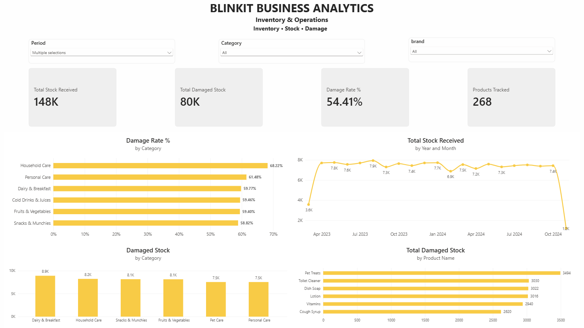
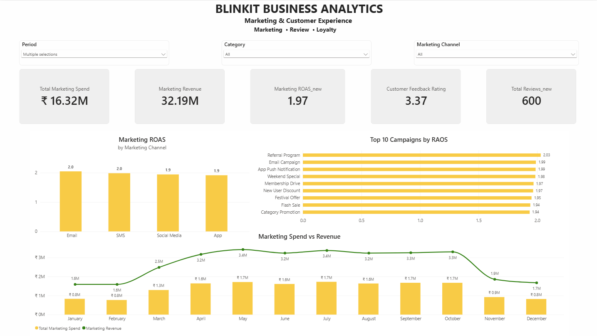

# Blinkit-Business-Analytics
# Blinkit Business Analytics

A Power BI business analytics project built using a Blinkit dataset.

The project focuses on understanding business performance across revenue, customers, inventory, delivery operations, marketing, and customer feedback.

## Dashboard

The Power BI report has 4 pages:

### Executive Overview

* Overall revenue, orders, AOV, rating and damage rate
* Top brands by revenue
* Revenue by customer segment
* Delivery status distribution
* Customer rating distribution

### Revenue & Customer Analysis

* Revenue trend over time
* Revenue by category
* Top products by revenue
* Orders by payment method

### Inventory & Operations

* Stock received
* Damaged stock
* Damage rate by category
* Stock received trend
* Top products by damaged stock

### Marketing & Customer Experience

* Marketing spend and generated revenue
* Marketing ROAS
* ROAS by marketing channel
* Top campaigns by ROAS
* Customer feedback and ratings

## Tools Used

* Power BI
* DAX
* SQL
* Python

## Project Structure

```text
Blinkit-Business-Analytics/
├── Dashboard/
│   └── DASHBOARD.pbix
├── Dataset/
├── Python/
├── SQL/
├── Screenshots/
└── README.md
```

## Screenshots

### Executive Overview



### Revenue & Customer Analysis



### Inventory & Operations



### Marketing & Customer Experience



## How to View

Download the `.pbix` file from the `Dashboard` folder and open it using Power BI Desktop.

## What I Worked On

This project involved data preparation, DAX measures, data modeling, interactive filters, and dashboard design, with a focus on presenting the data as a business story rather than just individual charts.

